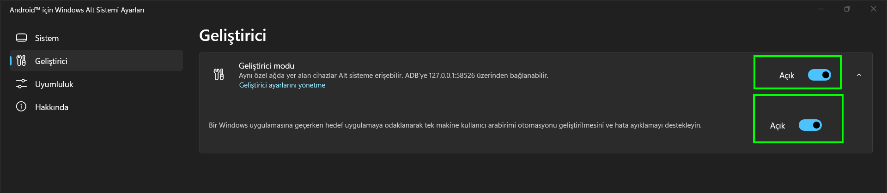

# ⚒ WSATools ile APK Yükleme

## Gerekliler


Garanti olması açısından yapmanız gerekir


* [Geliştirici Modunu aktif etmelisiniz.](wsatools-ile-apk-yuekleme.md#wsa-gelistirici-modunu-acma)

### WSA Geliştirici Modunu açma


Windows Altsistem android ayarları veya Windows Subsystem for android diye geçebilir uygulama ismi


WSA'yı açınız.

Ardından "Geliştirici Modu" aktif ediniz.

<figure><figcaption></figcaption></figure>

## MS Store üzerinden indirme & yükleme

[https://www.microsoft.com/store/productId/9N4P75DXL6FG](https://www.microsoft.com/store/productId/9N4P75DXL6FG) adresine gidiyoruz Türkçe olarak açıldıysa "Al" ingilizce olarak açıldıysa "get" button basıyoruz. Ardından Microsoft store açmak istediğini belirtiyor tarayıcımız tamam basıyoruz.

.png>)

ve buradan "Yükle" veya "Al" basarak indiriyoruz.

## WSATools ile APK Yükleme

WSATools uygulamamızı açıyoruz.

ve "Select an APK" Basıyoruz

<figure><figcaption></figcaption></figure>

ardından APK Dosyamızın konumuna gidip dosyamızı seçelim ve load apk seçeneğini işaretleyin.

.png>)

ve install button basın.

.png>)

başarıyla tamamlandıysa tüm işlemler. başarıyla yüklemiş olduk apk uygulamamızı.

